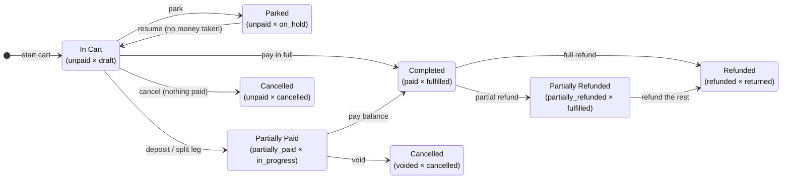

# Order state machine — reference

**Audience:** extension/flow authors (human or agent), task-manager, product, and QA.
**Engine source of truth:** `@final-commerce/common` → `order-state-machine/` (engine v2.1.3). Command-frame surfaces the engine through the actions listed below; the exact behavior you observe depends on the engine version pinned by the host runtime (kaching).

---

## 1. The model in one paragraph

Every order carries **two independent states** — a **payment state** (where the money is) and a **fulfillment state** (where the goods/service is). The pair of the two is the order's true state. Customers and staff never see the raw pair: a single **display label** (e.g. _"Completed"_, _"Parked - Deposit Received"_) is derived from the pair and **saved on the order at write time** (`order.paymentState`, `order.fulfillmentState`, `order.displayState`). The legacy `order.status` field is still written for backwards compatibility, but the pair is authoritative.

Why two axes? Because money and goods move independently: an order can be fully paid but not yet handed over, partially refunded but fully fulfilled, or returned with the money kept as store credit. One combined status can't say all of that; a pair can.

## 2. Working with order state from an extension

| You want to…                                              | Use                                                                                                                                                                                                                                                                                                                                                                     |
| --------------------------------------------------------- | ----------------------------------------------------------------------------------------------------------------------------------------------------------------------------------------------------------------------------------------------------------------------------------------------------------------------------------------------------------------------- |
| Ask "would this move be allowed?" (read-only)             | [`canTransition`](../src/actions/can-transition/README.md)                                                                                                                                                                                                                                                                                                              |
| List the moves currently offered for an order (read-only) | [`getAvailableTransitions`](../src/actions/get-available-transitions/README.md)                                                                                                                                                                                                                                                                                         |
| Move the fulfillment axis                                 | [`applyTransition`](../src/actions/apply-transition/README.md) — takes `targetFulfillmentState` only; **the payment axis is never client-settable**                                                                                                                                                                                                                     |
| Park / resume / delete a parked order                     | [`parkOrder`](../src/actions/park-order/README.md), [`resumeParkedOrder`](../src/actions/resume-parked-order/README.md), [`deleteParkedOrder`](../src/actions/delete-parked-order/README.md) — built on `applyTransition` with extra business-flow guarantees; prefer these when they fit                                                                               |
| Void an order                                             | [`voidOrder`](../src/actions/void-order/README.md)                                                                                                                                                                                                                                                                                                                      |
| Move the payment axis                                     | A **money operation**, never a state call: payments (`cashPayment`, `partialPayment`, `terminalPayment`, `tapToPayPayment`, `extensionPayment`, `integrationPayment`, `redeemPayment`) and refunds (`initiateRefund`, `processPartialRefund`, `redeemRefund`, planned via `getRefundPlan`). Each operation derives its landing pair from the money that actually moved. |

If a state looks wrong on the money side, the fix is a money operation (or a data correction) — never a manual state change.

---

## 3. Payment states (7)

| State (internal id)  | Label                    | Terminal | Meaning                                                                                                           |
| -------------------- | ------------------------ | -------- | ----------------------------------------------------------------------------------------------------------------- |
| `unpaid`             | Unpaid                   |          | No money captured yet.                                                                                            |
| `payment_pending`    | Payment Pending          |          | A payment was initiated but hasn't confirmed (async/external payment).                                            |
| `partially_paid`     | Partially Paid           |          | Some money captured — a deposit or the first leg of a split payment.                                              |
| `paid`               | Paid                     |          | The full amount is captured.                                                                                      |
| `partially_refunded` | Partially Refunded       |          | Some captured money was returned; the rest is still held.                                                         |
| `refunded`           | Refunded                 | ✅       | All captured money was returned. **Final** — the payment state never changes again.                               |
| `voided`             | _(displays "Cancelled")_ | ✅       | The order's money side was nullified without a capture-and-refund cycle (e.g. a parked order deleted). **Final.** |

## 4. Fulfillment states (9)

| State (internal id)   | Label               | Terminal | Meaning                                                                          |
| --------------------- | ------------------- | -------- | -------------------------------------------------------------------------------- |
| `draft`               | Draft               |          | Cart being built; not yet a placed order.                                        |
| `pending`             | Pending             |          | Placed, work not started.                                                        |
| `on_hold`             | **Parked**          |          | Held for later. _"Parked" is the product term; the internal id stays `on_hold`._ |
| `in_progress`         | In Progress         |          | Being prepared / worked on.                                                      |
| `partially_fulfilled` | Partially Fulfilled |          | Some items handed over, some not.                                                |
| `fulfilled`           | Fulfilled           | ✅       | Everything handed over / delivered.                                              |
| `partially_returned`  | Partially Returned  |          | Some items came back.                                                            |
| `returned`            | Returned            | ✅       | Everything came back.                                                            |
| `cancelled`           | Cancelled           | ✅       | Called off.                                                                      |

> "Terminal" marks a natural resting state for that axis. It is not by itself a hard lock — e.g. a _Fulfilled_ order can still move to _Returned_ through the return flow. Hard locks come only from the financial invariants (§7): a **fully refunded or voided** order is frozen for real.

---

## 5. Display labels — what people see

Every one of the 63 possible pairs resolves to a label. Precedence:

1. **Explicit pair label** (table below).
2. **Terminal money fact** — once money is finally settled, the label follows the money alone: any `refunded × *` pair reads **"Refunded"**, any `voided × *` pair reads **"Cancelled"**.
3. **Generic compound** — everything else reads `"<Payment> / <Fulfillment>"` (e.g. _"Paid / In Progress"_).

| Pair (payment × fulfillment)            | Display label                   |
| --------------------------------------- | ------------------------------- |
| unpaid × draft                          | **In Cart**                     |
| unpaid × pending                        | **Pending Payment**             |
| unpaid × on_hold                        | **Parked**                      |
| unpaid × cancelled                      | **Cancelled**                   |
| partially_paid × pending                | **Deposit Received**            |
| partially_paid × on_hold                | **Parked - Deposit Received**   |
| partially_paid × in_progress            | **Partially Paid**              |
| paid × pending                          | **Paid - Awaiting Fulfillment** |
| paid × on_hold                          | **Parked - Paid**               |
| paid × fulfilled                        | **Completed**                   |
| partially_refunded × fulfilled          | **Partially Refunded**          |
| partially_refunded × partially_returned | **Partially Refunded**          |
| refunded × _anything_                   | **Refunded**                    |
| voided × _anything_                     | **Cancelled**                   |

Two things worth knowing:

- **"Cancelled" appears twice** on purpose: `unpaid × cancelled` (an order called off before money moved) and `voided × cancelled` (a money-side void). They read the same to a customer; the pair tells staff which one it was.
- **Labels are persisted, not recomputed.** Renaming a label that live orders already carry requires a data migration (this is how the _on_hold →_ "Parked" realignment shipped). Never assert on `displayState` as if it were derived on read.

---

## 6. What decides whether an order can move

Every requested move (`from` pair → `to` pair) passes through four layers, in order. The first layer that objects blocks the move. This is the same guard chain behind `canTransition`, `getAvailableTransitions`, and `applyTransition` — a blocked call reports the layer in `result.blockedBy`.

| Layer                       | `blockedBy`           | What it is                                                                                                                                                   | Configurable?                                                                                                                        |
| --------------------------- | --------------------- | ------------------------------------------------------------------------------------------------------------------------------------------------------------ | ------------------------------------------------------------------------------------------------------------------------------------ |
| 1. **Financial invariants** | `financial_invariant` | Hard-coded money-integrity rules (§7).                                                                                                                       | **No — never.**                                                                                                                      |
| 2. **Cross-axis rules**     | `cross_axis_rule`     | "When axis A enters X, axis B must be in Y" rules (e.g. _require payment before fulfillment completes_).                                                     | Yes — merchant-toggleable. **The default and POS preset ship with none enabled**; a standard catalog exists to turn on per merchant. |
| 3. **Path rules**           | `path`                | Per-axis allowed edges. Each axis is `permissive` (any move allowed — the default) or `strict` (only listed edges).                                          | Yes.                                                                                                                                 |
| 4. **Conditions**           | `condition`           | Data checks attached to a specific path edge (e.g. "balance must be 0"), evaluated against the order's context. Failures are itemized in `failedConditions`. | Yes.                                                                                                                                 |

**New orders** (created directly into a state, `from = null` — e.g. `canTransition` with no resolvable order) are checked against layers 1–2 only. A list of _valid initial states_ exists (§9) but is enforced only when a config opts in — the POS preset does not.

---

## 7. Financial invariants — the nine hard rules

These cannot be configured away by any merchant or admin. Each one protects the same principle: **captured money only ever leaves through the refund flow, and settled money is final.** The invariant `id` is what `canTransition` / `applyTransition` return in `result.guard`.

| #   | Invariant id                                 | Plain English                                                                                                                                                                                                                                                 |
| --- | -------------------------------------------- | ------------------------------------------------------------------------------------------------------------------------------------------------------------------------------------------------------------------------------------------------------------- |
| 1   | `no-leave-refunded`                          | Once fully refunded, the payment state never changes again. No "un-refund".                                                                                                                                                                                   |
| 2   | `no-leave-voided`                            | Once voided, payment stays voided.                                                                                                                                                                                                                            |
| 3   | `no-refund-without-fulfillment`              | An order can only become _fully refunded_ when fulfillment is Fulfilled, Returned, Partially Returned, or Cancelled — you can't fully refund an order that's still being worked.                                                                              |
| 4   | `no-partial-refund-in-draft`                 | A cart (Draft) can't be partially refunded — there's nothing to refund against yet.                                                                                                                                                                           |
| 5   | `no-payment-regression`                      | Payment never moves backwards (Paid → Partially Paid → Unpaid). Collected money leaves via refund, not by editing the state.                                                                                                                                  |
| 6   | `no-cancel-with-unreturned-payments`         | Fulfillment can't move to Cancelled while payment still holds unreturned money (Partially Paid / Paid / Partially Refunded). Return the money first: full refund of an unfulfilled order lands **Refunded × Cancelled**; a void lands **Voided × Cancelled**. |
| 7   | `no-draft-regression-with-captured-payments` | An order that has captured money can never go back to Draft — it stopped being a cart the moment money moved. (This is why resuming a deposit-carrying parked order lands on _In Progress_, not _Draft_.)                                                     |
| 8   | `no-reopen-voided-fulfillment`               | A voided order exists only at Cancelled fulfillment — it can't re-enter the fulfillment flow.                                                                                                                                                                 |
| 9   | `no-reopen-refunded-fulfillment`             | A fully refunded order can only rest at Returned or Cancelled (it may relabel between those two), never re-enter fulfillment.                                                                                                                                 |

### What is deliberately **allowed**

- **Returned or Partially Returned with money still held** (e.g. `paid × returned`) is a **valid** state — it's how exchanges and store credit work. Goods came back; the money stayed by agreement. Don't treat these pairs as data corruption, and don't write flows that "fix" them.
- **This invariant set is frozen** (product decision, 2026-08-27): no new financial invariants will be added. New behavior is shaped through the configurable layers (cross-axis rules, paths, conditions) and through which transitions the UI offers — not by hard-coding more blocks.

---

## 8. Who moves each axis

- **The payment axis moves only through money operations** — pay, refund, void (§2 lists the actions). Each operation computes its own landing pair from the money that actually moved. Nobody (user, UI, or extension) sets a payment state by hand — `applyTransition` doesn't even accept one.
- **The fulfillment axis is what manual transitions move.** `applyTransition` takes a `targetFulfillmentState` and keeps payment unchanged. On engine ≥ 2.1.4, `getAvailableTransitions` likewise offers fulfillment-axis moves only; on older engines the list may include payment-axis pairs that no command-frame action can actually apply — skip them.

---

## 9. Where new orders start (POS preset)

The POS preset recognizes these initial pairs (first write of an order to the DB):

| Initial pair                 | Display          | When                                                                                                 |
| ---------------------------- | ---------------- | ---------------------------------------------------------------------------------------------------- |
| unpaid × draft               | In Cart          | Normal cart.                                                                                         |
| unpaid × on_hold             | Parked           | Parked before any payment.                                                                           |
| unpaid × pending             | Pending Payment  | Placed, awaiting payment.                                                                            |
| paid × fulfilled             | Completed        | Quick sale — pay and hand over in one step (e.g. gift card).                                         |
| partially_paid × in_progress | Partially Paid   | Deposit / first split-payment leg on a new order — the first payment advances fulfillment off Draft. |
| partially_paid × pending     | Deposit Received | Deposit taken, work not started.                                                                     |
| partially_paid × draft       | _(compound)_     | **Legacy only** — kept for older POS builds that still emit it.                                      |

## 10. Common journeys

Notes on the diagram:

- A parked order **with a deposit** resumes to _In Progress_ (Partially Paid), never back to _In Cart_ — invariant #7.
- There is no arrow from _Partially Paid_ to a plain _Cancelled_: money must be refunded or voided first — invariant #6.
- Nothing ever leaves _Refunded_ or the voided _Cancelled_ — invariants #1, #2, #8, #9.

## 11. Legacy status mapping

Orders predating the state machine (or arriving from old writers) are inferred from the legacy `order.status`:

| Legacy status               | Inferred pair                           | Display                   |
| --------------------------- | --------------------------------------- | ------------------------- |
| `completed`                 | paid × fulfilled                        | Completed                 |
| `in-cart`                   | unpaid × draft                          | In Cart                   |
| `parked` (nothing paid)     | unpaid × on_hold                        | Parked                    |
| `parked` (something paid)   | partially_paid × on_hold                | Parked - Deposit Received |
| `park-deleted`              | voided × cancelled                      | Cancelled                 |
| `refunded`                  | refunded × returned                     | Refunded                  |
| `partial-refund`            | partially_refunded × partially_returned | Partially Refunded        |
| _(empty, has refund lines)_ | partially_refunded × partially_returned | Partially Refunded        |
| _(anything else)_           | unpaid × pending                        | Pending Payment           |

The legacy `order.status` field continues to be written on every state change (mapped back from the pair) so old consumers keep working, but it is **read-only for humans and extensions** — never edit it directly.

---

## 12. FAQ

**Why does a voided order say "Cancelled"?**
Because that's what the one reachable voided pair (`voided × cancelled`) always displayed, and "Voided" means nothing to a customer. The pair distinguishes it internally.

**Why did the order jump to "Partially Paid / In Progress" after a deposit?**
By design: the first captured payment advances the order off Draft — an order carrying money is no longer a cart (invariant #7).

**Why can't I cancel this paid order?**
Cancel is a fulfillment move, and fulfillment can't enter Cancelled while payment holds unreturned money (invariant #6). Refund it (→ Refunded, shown as such) or void it (→ Cancelled) instead.

**Why does this order say "Returned" but the money wasn't refunded?**
That's a valid state — exchanges and store credit return the goods without returning the money. The refund flow, if and when it runs, moves the payment axis separately.

**How do I move an order's state from a flow?**
Fulfillment axis: `applyTransition` (or the dedicated `parkOrder` / `resumeParkedOrder` / `voidOrder` flows). Payment axis: run the actual money operation. There is no action that sets a payment state directly — by design.

**Can a merchant relax the money rules?**
No. Layers 2–4 (cross-axis rules, paths, conditions) are configurable; the nine financial invariants are not.
