# Types Reference

Field-level reference for the core domain model types exported from `@final-commerce/command-frame` (orders, cart, customers, products, refunds, context, and related primitives).

These domain model types are defined in [`CommonTypes.ts`](../CommonTypes.ts) (at the repository root: `src/CommonTypes.ts`) and re-exported from the package root.

Additional package exports (command params/responses, pub/sub event payloads, and hooks types) are documented in their subsystem READMEs and re-exported from [`index.ts`](../index.ts).

```typescript
import type { CFOrder, CFLineItem, CFDiscountDetail /* ... */ } from '@final-commerce/command-frame';
```

## Commands and wire types

Host-callable actions are grouped on the **`command`** export from `@final-commerce/command-frame` (see [`index.ts`](../index.ts)). Each action folder under `src/actions/<name>/` defines `Params` / `Response` types and a README; those types are re-exported from the package root for imports such as `GetProductsParams`.

Project-specific clients wrap the same registry with host mocks:

- **Render (POS):** `RenderClient` / `renderClient` in [`src/projects/render/client.ts`](../projects/render/client.ts)
- **Manage (dashboard):** `ManageClient` / `manageClient` in [`src/projects/manage/client.ts`](../projects/manage/client.ts)

## Table of Contents

- [Enums](#enums) -- CurrencyCode, CFProductType, CFUserTypes
- [Order Types](#order-types) -- CFOrder, CFActiveOrder
- [Line Item Types](#line-item-types) -- CFLineItem, CFCustomSale, CFRefundedLineItem, CFRefundedCustomSale
- [Discount Types](#discount-types) -- CFDiscount, CFDiscountDetail, CFDiscountLineItem
- [Fee Types](#fee-types) -- CFCustomFee, CFFeeDetail, CFFeeLineItem
- [Summary & Payment Types](#summary--payment-types) -- CFSummary, CFTip, CFPaymentMethod, CFTipPayment, CFCartDiscountItem, CFCartFeeItem
- [Customer Types](#customer-types) -- CFCustomer, CFActiveCustomer, CFCustomerNote
- [Cart Types](#cart-types) -- CFActiveCart, CFNonRevenueItem, CFActiveProduct, CFActiveCustomSales
- [Product Types](#product-types) -- CFProduct, CFProductVariant, CFCategory, CFInventory
- [Refund Types](#refund-types) -- CFRefundItem, CFRefundedTipPayment
- [System Types](#system-types) -- CFActiveUser, CFActiveUserRole, CFActiveOutlet, CFActiveStation, CFSession, CFActiveRefundDetails, CFRefundProcessingStatus, CFActiveCompany, CFPosDataItem, CFOrderNote
- [Address & Metadata](#address--metadata) -- CFAddress, CFMetadataItem, CFTax
- [Context Types](#context-types) -- CFContextRender, CFContextManage, CFOutletInfo, CFProjectName, CFContext
- [Custom Data Types](#custom-data-types) -- CFCustomTable, CFCustomTableField, CustomExtension, AttributeType

## Type Relationships

```mermaid
graph TD
    CFOrder --> CFLineItem
    CFOrder --> CFCustomSale
    CFOrder --> CFNonRevenueItem
    CFOrder --> CFSummary
    CFOrder --> CFPaymentMethod
    CFOrder --> CFCartDiscountItem
    CFOrder --> CFCartFeeItem
    CFOrder --> CFActiveCustomer
    CFOrder --> CFRefundItem
    CFOrder --> CFPosDataItem
    CFOrder --> CFOrderNote
    CFOrder --> CFAddress
    CFOrder --> CFMetadataItem

    CFLineItem --> CFDiscountLineItem
    CFLineItem --> CFFeeLineItem
    CFLineItem --> CFTax
    CFLineItem --> CFMetadataItem

    CFDiscountLineItem --> CFDiscountDetail
    CFFeeLineItem --> CFFeeDetail

    CFCustomSale --> CFDiscountDetail
    CFCustomSale --> CFFeeDetail
    CFCustomSale --> CFTax

    CFSummary --> CFTax
    CFSummary --> CFTip

    CFPaymentMethod --> CFTipPayment

    CFRefundItem --> CFRefundedLineItem
    CFRefundItem --> CFRefundedCustomSale
    CFRefundItem --> CFCartFeeItem
    CFRefundItem --> CFRefundedTipPayment
    CFRefundItem --> CFSummary
    CFRefundItem --> CFPaymentMethod

    CFRefundedLineItem --> CFDiscountLineItem
    CFRefundedLineItem --> CFFeeLineItem
    CFRefundedLineItem --> CFTax

    CFActiveOrder --> CFOrder
    CFActiveOrder --> CFActiveUser
    CFActiveOrder --> CFActiveOutlet
    CFActiveOrder --> CFActiveStation

    CFActiveCart --> CFActiveProduct
    CFActiveCart --> CFActiveCustomSales
    CFActiveCart --> CFNonRevenueItem
    CFActiveCart --> CFDiscount
    CFActiveCart --> CFCustomFee
    CFActiveCart --> CFCustomer

    CFActiveProduct --> CFDiscount
    CFActiveProduct --> CFCustomFee

    CFCustomer --> CFCustomerNote
    CFCustomer --> CFAddress
    CFActiveCustomer --> CFCustomer

    CFProduct --> CFProductVariant
    CFProductVariant --> CFInventory

    CFActiveUser --> CFActiveUserRole
```



---

## Enums

### CurrencyCode

ISO 4217 currency codes supported by the system.

| Value | Description |
|-------|-------------|
| `USD` | `"USD"` -- US Dollar |
| `EUR` | `"EUR"` -- Euro |
| `GBP` | `"GBP"` -- British Pound |
| `CAD` | `"CAD"` -- Canadian Dollar |
| `AUD` | `"AUD"` -- Australian Dollar |
| `NZD` | `"NZD"` -- New Zealand Dollar |
| `CHF` | `"CHF"` -- Swiss Franc |
| `CNY` | `"CNY"` -- Chinese Yuan |
| `INR` | `"INR"` -- Indian Rupee |
| `MXN` | `"MXN"` -- Mexican Peso |
| `BRL` | `"BRL"` -- Brazilian Real |
| `ZAR` | `"ZAR"` -- South African Rand |
| `SGD` | `"SGD"` -- Singapore Dollar |
| `HKD` | `"HKD"` -- Hong Kong Dollar |
| `SEK` | `"SEK"` -- Swedish Krona |
| `NOK` | `"NOK"` -- Norwegian Krone |
| `DKK` | `"DKK"` -- Danish Krone |
| `PLN` | `"PLN"` -- Polish Zloty |
| `THB` | `"THB"` -- Thai Baht |
| `MYR` | `"MYR"` -- Malaysian Ringgit |
| `PHP` | `"PHP"` -- Philippine Peso |
| `IDR` | `"IDR"` -- Indonesian Rupiah |
| `AED` | `"AED"` -- UAE Dirham |
| `SAR` | `"SAR"` -- Saudi Riyal |
| `ILS` | `"ILS"` -- Israeli Shekel |
| `TRY` | `"TRY"` -- Turkish Lira |
| `RUB` | `"RUB"` -- Russian Ruble |
| `JPY` | `"JPY"` -- Japanese Yen |
| `KRW` | `"KRW"` -- South Korean Won |
| `VND` | `"VND"` -- Vietnamese Dong |
| `CLP` | `"CLP"` -- Chilean Peso |
| `ISK` | `"ISK"` -- Icelandic Krona |
| `HUF` | `"HUF"` -- Hungarian Forint |
| `TWD` | `"TWD"` -- New Taiwan Dollar |
| `KWD` | `"KWD"` -- Kuwaiti Dinar |
| `BHD` | `"BHD"` -- Bahraini Dinar |
| `OMR` | `"OMR"` -- Omani Rial |
| `JOD` | `"JOD"` -- Jordanian Dinar |
| `TND` | `"TND"` -- Tunisian Dinar |
| `LYD` | `"LYD"` -- Libyan Dinar |
| `IQD` | `"IQD"` -- Iraqi Dinar |

### CFProductType

| Value | Description |
|-------|-------------|
| `SIMPLE` | `"simple"` -- A product without variants |
| `VARIABLE` | `"variable"` -- A product with one or more variants |

### CFUserTypes

| Value | Description |
|-------|-------------|
| `OWNER` | `"owner"` |
| `ORG_USER` | `"organization_user"` |
| `ORG_OWNER` | `"organization_owner"` |
| `FINAL_USER` | `"final_user"` |
| `FINAL_OWNER` | `"final_owner"` |
| `EMPLOYEE` | `"employee"` |
| `SUPER_ADMIN` | `"super_admin"` |
| `MANAGER` | `"manager"` |
| `ADMIN` | `"admin"` |
| `ASSISTANT_MANAGER` | `"assistant"` |
| `CASHIER` | `"cashier"` |
| `RESELLER` | `"reseller"` |

---

## Order Types

### CFOrder

The core order object returned by `getOrders`, published in `order-created` / `order-updated` events.

| Field | Type | Required | Description |
|-------|------|----------|-------------|
| `_id` | `string` | Yes | Unique order identifier |
| `currency` | [`CurrencyCode`](#currencycode) | Yes | Currency code for the order |
| `minorUnits` | `number` | Yes | Number of minor units (decimal places) for the currency |
| `receiptId` | `string` | No | Receipt identifier |
| `companyId` | `string` | Yes | Company this order belongs to |
| `externalId` | `string \| null` | Yes | External system identifier |
| `status` | `string` | Yes | Order status (e.g. `"completed"`, `"pending"`) |
| `customer` | `Partial<`[`CFActiveCustomer`](#cfactivecustomer)` \| null>` | Yes | Customer attached to the order |
| `customerNote` | `string` | No | Note from the customer |
| `summary` | [`CFSummary`](#cfsummary) | Yes | Order totals, taxes, tip, discount summary |
| `cartDiscount` | [`CFCartDiscountItem`](#cfcartdiscountitem)` \| null` | Yes | Cart-level discount applied |
| `cartFees` | [`CFCartFeeItem`](#cfcartfeeitem)`[] \| null` | Yes | Cart-level fees applied |
| `updatedAt` | `string` | No | ISO timestamp of last update (server-side) |
| `createdAt` | `string` | No | ISO timestamp of creation |
| `paymentMethods` | [`CFPaymentMethod`](#cfpaymentmethod)`[]` | Yes | Payments made on the order |
| `source` | `string` | Yes | Origin of the order (e.g. `"pos"`) |
| `posData` | [`CFPosDataItem`](#cfposdataitem)` \| null` | Yes | POS context (outlet, station, employee) |
| `sessionId` | `string` | Yes | Session identifier |
| `metadata` | [`CFMetadataItem`](#cfmetadataitem)`[]` | Yes | Key-value metadata pairs |
| `notes` | [`CFOrderNote`](#cfordernote)`[] \| null` | No | Order notes |
| `billing` | [`CFAddress`](#cfaddress)` \| null` | Yes | Billing address |
| `shipping` | [`CFAddress`](#cfaddress)` \| null` | Yes | Shipping address |
| `lineItems` | [`CFLineItem`](#cflineitem)`[]` | Yes | Product line items |
| `customSales` | [`CFCustomSale`](#cfcustomsale)`[]` | Yes | Custom sale items |
| `nonRevenueItems` | [`CFNonRevenueItem`](#cfnonrevenueitem)`[]` | No | Non-revenue lines (e.g. gift card load), same shape as cart |
| `refund` | [`CFRefundItem`](#cfrefunditem)`[]` | No | Refund records |
| `balance` | `number` | Yes | Remaining balance |
| `signature` | `string \| null` | No | Customer signature data |

### CFActiveOrder

Extends [`CFOrder`](#cforder) with runtime fields used in the POS session.

| Field | Type | Required | Description |
|-------|------|----------|-------------|
| *(all CFOrder fields)* | | | |
| `id` | `string` | No | Alias for `_id` |
| `internalId` | `string` | No | Internal runtime identifier |
| `user` | [`CFActiveUser`](#cfactiveuser) | No | User who created the order |
| `outlet` | [`CFActiveOutlet`](#cfactiveoutlet) | No | Outlet where the order was placed |
| `isDeleted` | `boolean` | No | Soft-delete flag |
| `newOrder` | `boolean` | No | Whether this is a newly created order |
| `station` | [`CFActiveStation`](#cfactivestation) | No | Station where the order was placed |

---

## Line Item Types

### CFLineItem

A product line item within an order.

| Field | Type | Required | Description |
|-------|------|----------|-------------|
| `productId` | `string` | Yes | Product identifier |
| `variantExternalId` | `string` | No | External ID of the variant |
| `productExternalId` | `string` | No | External ID of the product |
| `internalId` | `string` | No | Internal runtime identifier for cart operations |
| `name` | `string` | Yes | Product display name |
| `quantity` | `number` | Yes | Quantity ordered |
| `price` | `number` | Yes | Unit price |
| `taxes` | [`CFTax`](#cftax)`[]` | Yes | Taxes applied to this item |
| `discount` | [`CFDiscountLineItem`](#cfdiscountlineitem) | Yes | Item-level and cart-level discounts |
| `fee` | [`CFFeeLineItem`](#cffeelineitem) | Yes | Item-level and cart-level fees |
| `totalTax` | `number` | Yes | Total tax amount |
| `total` | `number` | Yes | Total after discounts, fees, and taxes |
| `metadata` | [`CFMetadataItem`](#cfmetadataitem)`[]` | Yes | Key-value metadata pairs |
| `image` | `string` | Yes | Primary image URL |
| `sku` | `string` | Yes | Stock keeping unit |
| `stock` | `number` | Yes | Stock level at time of order |
| `note` | `string` | No | Note attached to this line item |
| `description` | `string` | No | Product description |
| `variantId` | `string` | Yes | Variant identifier |
| `images` | `string[]` | No | Additional image URLs |
| `attributes` | `string` | No | Serialized variant attributes |

### CFCustomSale

A non-product sale item (e.g. service charge, manual entry).

| Field | Type | Required | Description |
|-------|------|----------|-------------|
| `customSaleId` | `string` | Yes | Unique custom sale identifier |
| `name` | `string` | Yes | Display name |
| `price` | `number` | Yes | Unit price |
| `quantity` | `number` | Yes | Quantity |
| `applyTaxes` | `boolean` | Yes | Whether taxes are applied |
| `total` | `number` | Yes | Total amount |
| `totalTax` | `number` | Yes | Total tax amount |
| `taxes` | [`CFTax`](#cftax)`[]` | Yes | Taxes applied |
| `discount.cartDiscount` | [`CFDiscountDetail`](#cfdiscountdetail) | Yes | Cart-level discount applied to this item |
| `fee.cartFee` | [`CFFeeDetail`](#cffeedetail) | Yes | Cart-level fee applied to this item |

### CFRefundedLineItem

A line item included in a refund. Same shape as [`CFLineItem`](#cflineitem) with `variantId` required and without `metadata` or `stock`.

| Field | Type | Required | Description |
|-------|------|----------|-------------|
| `productId` | `string` | Yes | Product identifier |
| `variantId` | `string` | Yes | Variant identifier |
| `variantExternalId` | `string` | No | External ID of the variant |
| `productExternalId` | `string` | No | External ID of the product |
| `internalId` | `string` | No | Internal runtime identifier |
| `name` | `string` | Yes | Product display name |
| `quantity` | `number` | Yes | Quantity refunded |
| `price` | `number` | Yes | Unit price |
| `taxes` | [`CFTax`](#cftax)`[]` | Yes | Taxes on the refunded item |
| `discount` | [`CFDiscountLineItem`](#cfdiscountlineitem) | Yes | Discounts that were applied |
| `totalTax` | `number` | Yes | Total tax amount |
| `total` | `number` | Yes | Total refund amount for this item |
| `image` | `string` | Yes | Primary image URL |
| `sku` | `string` | Yes | Stock keeping unit |
| `note` | `string` | No | Note attached to this item |
| `description` | `string` | No | Product description |
| `images` | `string[]` | No | Additional image URLs |
| `fee` | [`CFFeeLineItem`](#cffeelineitem) | Yes | Fees that were applied |

### CFRefundedCustomSale

Extends [`CFCustomSale`](#cfcustomsale). Same structure as a custom sale included in a refund.

---

## Discount Types

### CFDiscount

A discount applied to a product in the cart (before order creation).

| Field | Type | Required | Description |
|-------|------|----------|-------------|
| `value` | `number` | Yes | Discount value (fixed amount or percentage) |
| `label` | `string` | No | Display label for the discount |
| `isPercent` | `boolean` | No | If `true`, `value` is a percentage; if `false`, it is a fixed amount |

### CFDiscountDetail

A computed discount as it appears on an order line item or custom sale.

| Field | Type | Required | Description |
|-------|------|----------|-------------|
| `percentage` | `number` | Yes | Discount percentage (0 if fixed amount) |
| `amount` | `number` | Yes | Calculated discount amount |
| `label` | `string` | No | Display label for the discount |

### CFDiscountLineItem

Groups item-level and cart-level discounts for a single line item.

| Field | Type | Required | Description |
|-------|------|----------|-------------|
| `itemDiscount` | [`CFDiscountDetail`](#cfdiscountdetail) | Yes | Discount applied directly to this item |
| `cartDiscount` | [`CFDiscountDetail`](#cfdiscountdetail) | Yes | Share of the cart-level discount allocated to this item |

---

## Fee Types

### CFCustomFee

A fee applied to a product in the cart (before order creation).

| Field | Type | Required | Description |
|-------|------|----------|-------------|
| `label` | `string` | Yes | Display label for the fee |
| `amount` | `number` | Yes | Fee value (fixed amount or percentage) |
| `isPercent` | `boolean` | Yes | If `true`, `amount` is a percentage |
| `applyTaxes` | `boolean` | Yes | Whether taxes should be calculated on this fee |
| `taxTableId` | `string` | No | Tax table to use if `applyTaxes` is `true` |

### CFFeeDetail

A computed fee as it appears on an order line item or custom sale.

| Field | Type | Required | Description |
|-------|------|----------|-------------|
| `percentage` | `number` | Yes | Fee percentage (0 if fixed amount) |
| `amount` | `number` | Yes | Calculated fee amount |
| `tax` | `number` | Yes | Tax amount on the fee |
| `taxTableId` | `string` | Yes | Tax table used |
| `label` | `string` | No | Display label for the fee |

### CFFeeLineItem

Groups item-level and cart-level fees for a single line item.

| Field | Type | Required | Description |
|-------|------|----------|-------------|
| `itemFee` | [`CFFeeDetail`](#cffeedetail) | Yes | Fee applied directly to this item |
| `cartFee` | [`CFFeeDetail`](#cffeedetail) | No | Share of the cart-level fee allocated to this item |

---

## Summary & Payment Types

### CFSummary

Aggregate totals for an order.

| Field | Type | Required | Description |
|-------|------|----------|-------------|
| `discountTotal` | `number` | Yes | Total discount amount |
| `shippingTotal` | `number \| null` | No | Total shipping amount |
| `total` | `number` | Yes | Grand total |
| `totalTaxes` | `number` | Yes | Total tax amount |
| `subTotal` | `number` | Yes | Subtotal before taxes and discounts |
| `taxes` | [`CFTax`](#cftax)`[]` | Yes | Itemized tax breakdown |
| `tip` | [`CFTip`](#cftip)` \| null` | No | Tip information |
| `isTaxInclusive` | `boolean` | Yes | Whether prices include tax |
| `nonRevenueTotal` | `string` | No | Portion of order total that is non-revenue (e.g. gift card load) |

### CFTip

Tip information on an order summary.

| Field | Type | Required | Description |
|-------|------|----------|-------------|
| `amount` | `number` | Yes | Tip amount |
| `percentage` | `number` | Yes | Tip percentage |

### CFPaymentMethod

A payment transaction recorded on an order.

| Field | Type | Required | Description |
|-------|------|----------|-------------|
| `transactionId` | `string` | Yes | Unique transaction identifier |
| `paymentType` | `string` | Yes | Type of payment (e.g. `"cash"`, `"card"`) |
| `amount` | `number` | Yes | Amount paid |
| `timestamp` | `string` | Yes | ISO timestamp of the payment |
| `processor` | `string` | Yes | Payment processor name |
| `saleId` | `string` | No | Sale identifier from the processor |
| `change` | `number \| null` | No | Change given (cash payments) |
| `tip` | [`CFTipPayment`](#cftippayment)` \| null` | No | Tip included in this payment |
| `cashRounding` | `number` | No | Cash rounding adjustment |
| `emv` | `string \| null` | No | EMV card data |

### CFTipPayment

Tip details within a payment transaction.

| Field | Type | Required | Description |
|-------|------|----------|-------------|
| `amount` | `number` | Yes | Tip amount |
| `tipTo` | `string` | Yes | Recipient of the tip |
| `percentage` | `number` | Yes | Tip percentage |

### CFCartDiscountItem

A cart-level discount as stored on the order.

| Field | Type | Required | Description |
|-------|------|----------|-------------|
| `label` | `string` | Yes | Discount label |
| `amount` | `number` | Yes | Discount amount |
| `percentage` | `number` | Yes | Discount percentage |

### CFCartFeeItem

A cart-level fee as stored on the order.

| Field | Type | Required | Description |
|-------|------|----------|-------------|
| `id` | `string` | Yes | Fee identifier |
| `label` | `string` | Yes | Fee label |
| `amount` | `number` | Yes | Fee amount |
| `percentage` | `number` | Yes | Fee percentage |
| `taxTableId` | `string` | No | Tax table used for the fee |
| `tax` | `number` | No | Tax amount on the fee |
| `taxName` | `string` | Yes | Name of the tax applied |

---

## Customer Types

### CFCustomer

A customer record.

| Field | Type | Required | Description |
|-------|------|----------|-------------|
| `_id` | `string` | Yes | Unique customer identifier |
| `companyId` | `any` | Yes | Company this customer belongs to |
| `externalId` | `string` | No | External system identifier |
| `email` | `string` | Yes | Email address |
| `firstName` | `string` | Yes | First name |
| `lastName` | `string` | Yes | Last name |
| `fromOliver` | `boolean` | No | Legacy migration flag |
| `phone` | `string` | No | Phone number |
| `tags` | `string[]` | No | Customer tags |
| `metadata` | `Record<string, string>[]` | No | Key-value metadata |
| `notes` | [`CFCustomerNote`](#cfcustomernote)`[]` | No | Customer notes |
| `billing` | [`CFAddress`](#cfaddress)` \| null` | Yes | Billing address |
| `shipping` | [`CFAddress`](#cfaddress)` \| null` | Yes | Shipping address |
| `createdAt` | `string` | No | ISO timestamp of creation |
| `updatedAt` | `string` | No | ISO timestamp of last update |

### CFActiveCustomer

Extends [`CFCustomer`](#cfcustomer) with an optional runtime `id` alias.

| Field | Type | Required | Description |
|-------|------|----------|-------------|
| *(all CFCustomer fields)* | | | |
| `id` | `string` | No | Alias for `_id` |

### CFCustomerNote

A note attached to a customer.

| Field | Type | Required | Description |
|-------|------|----------|-------------|
| `createdAt` | `string` | Yes | ISO timestamp of when the note was created |
| `message` | `string` | Yes | Note content |

---

## Cart Types

### CFActiveCart

The current cart state in the POS session.

| Field | Type | Required | Description |
|-------|------|----------|-------------|
| `tax` | `number` | No | Total tax amount |
| `total` | `number` | Yes | Cart total |
| `subtotal` | `number` | Yes | Subtotal before taxes and discounts |
| `discount` | [`CFDiscount`](#cfdiscount) | No | Cart-level discount |
| `customFee` | [`CFCustomFee`](#cfcustomfee)`[]` | No | Cart-level custom fees |
| `products` | [`CFActiveProduct`](#cfactiveproduct)`[]` | Yes | Products in the cart |
| `customSales` | [`CFActiveCustomSales`](#cfactivecustomsales)`[]` | No | Custom sale items in the cart |
| `remainingBalance` | `number` | No | Remaining balance for split payments |
| `amountToBeCharged` | `number` | Yes | Amount to be charged |
| `customer` | `Partial<`[`CFCustomer`](#cfcustomer)` \| null> \| null` | No | Customer assigned to the cart |
| `orderNotes` | `string` | No | Order-level notes |
| `cartTotal` | `number` | No | Cart total (alternative calculation) |
| `orderTotal` | `number` | No | Order total (alternative calculation) |
| `orderId` | `string` | No | Associated order ID (for resumed orders) |
| `nonRevenueItems` | [`CFNonRevenueItem`](#cfnonrevenueitem)`[]` | No | Gift card / liability lines included in cart total |

### CFNonRevenueItem

Non-revenue cart line (e.g. gift card load). Aligns with the host `NonRevenueItem` shape.

| Field | Type | Required | Description |
|-------|------|----------|-------------|
| `externalId` | `string` | Yes | Unique line id generated by the host (persisted on orders). |
| `amount` | `number \| string` | Yes | Line amount (major or minor units per host; same convention as cart totals). |
| `label` | `string` | No | Display label |
| `metadata` | `Record<string, unknown>` | No | Often includes `refId` (extension reference from `addNonRevenueItem` params `id`). |
| `applyTaxes` | `boolean` | No | When true, line may be taxed |
| `taxTableId` | `string` | No | Tax table when taxing applies |

### CFActiveProduct

A product in the active cart.

| Field | Type | Required | Description |
|-------|------|----------|-------------|
| `id` | `string` | Yes | Product identifier |
| `internalId` | `string` | Yes | Unique cart line-item identifier |
| `externalId` | `string` | Yes | External product identifier |
| `productExternalId` | `string` | Yes | External product-level identifier |
| `variantId` | `string` | Yes | Variant identifier |
| `name` | `string` | Yes | Product display name |
| `sku` | `string` | Yes | Stock keeping unit |
| `price` | `number` | Yes | Unit price |
| `images` | `string[]` | Yes | Product image URLs |
| `taxTableId` | `string` | Yes | Tax table identifier |
| `quantity` | `number` | Yes | Quantity in the cart |
| `note` | `string` | No | Note for this item |
| `discount` | [`CFDiscount`](#cfdiscount) | No | Discount applied to this item |
| `description` | `string` | No | Product description |
| `longDescription` | `string` | No | Long product description |
| `shortDescription` | `string` | No | Short product description |
| `barcodeId` | `string` | No | Barcode identifier |
| `stock` | `number` | Yes | Current stock level |
| `allowBackOrder` | `boolean` | No | Whether back-ordering is allowed |
| `fee` | [`CFCustomFee`](#cfcustomfee) | No | Fee applied to this item |
| `isUnlimited` | `boolean` | No | Whether stock is unlimited |
| `attributes` | `string` | No | Serialized variant attributes |
| `localQuantity` | `number` | No | Local quantity (offline sync) |

### CFActiveCustomSales

A custom sale item in the active cart.

| Field | Type | Required | Description |
|-------|------|----------|-------------|
| `id` | `string` | Yes | Custom sale identifier |
| `name` | `string` | Yes | Display name |
| `applyTaxes` | `boolean` | Yes | Whether taxes are applied |
| `taxTableId` | `string` | No | Tax table identifier |
| `quantity` | `number` | Yes | Quantity |
| `price` | `number` | Yes | Unit price |
| `discount` | `any` | No | Discount applied |
| `fee` | `any` | No | Fee applied |

---

## Product Types

### CFProduct

A product from the catalog.

| Field | Type | Required | Description |
|-------|------|----------|-------------|
| `_id` | `string` | Yes | Unique product identifier |
| `companyId` | `string` | No | Company identifier |
| `externalId` | `string` | No | External system identifier |
| `taxTable` | `string` | Yes | Tax table identifier |
| `name` | `string` | Yes | Product name |
| `description` | `string` | No | Full description |
| `shortDescription` | `string` | No | Short description |
| `images` | `string[]` | No | Image URLs |
| `categories` | `string[]` | Yes | Category IDs this product belongs to |
| `attributes` | `{ name: string; values: string[] }[]` | Yes | Product attributes and their possible values |
| `tags` | `string[]` | No | Product tags |
| `supplier` | `string` | No | Supplier name |
| `sku` | `string` | No | Stock keeping unit |
| `productType` | [`CFProductType`](#cfproducttype) | Yes | `"simple"` or `"variable"` |
| `variants` | [`CFProductVariant`](#cfproductvariant)`[]` | Yes | Product variants |
| `currency` | [`CurrencyCode`](#currencycode) | Yes | Currency code for the product |
| `minorUnits` | `number` | Yes | Number of minor units (decimal places) for the currency |
| `minPrice` | `number` | No | Minimum variant price |
| `maxPrice` | `number` | No | Maximum variant price |
| `status` | `string` | No | Product status |
| `isDeleted` | `boolean` | No | Soft-delete flag |

### CFProductVariant

A specific variant of a product.

| Field | Type | Required | Description |
|-------|------|----------|-------------|
| `_id` | `string` | Yes | Unique variant identifier |
| `sku` | `string` | Yes | Stock keeping unit |
| `price` | `number` | Yes | Regular price |
| `salePrice` | `number` | Yes | Sale price |
| `isOnSale` | `boolean` | Yes | Whether the variant is on sale |
| `barcode` | `string` | No | Barcode value |
| `costPrice` | `number` | No | Cost price |
| `manageStock` | `boolean` | Yes | Whether stock is tracked |
| `externalId` | `string` | No | External system identifier |
| `inventory` | [`CFInventory`](#cfinventory)`[]` | No | Stock levels per outlet |
| `allowBackorder` | `boolean` | No | Whether back-ordering is allowed |
| `images` | `string[]` | No | Variant-specific image URLs |
| `attributes` | `{ name: string; value?: string }[]` | Yes | Attribute values for this variant |
| `metadata` | `{ key: string; value: string }[]` | No | Key-value metadata |

### CFCategory

A product category.

| Field | Type | Required | Description |
|-------|------|----------|-------------|
| `_id` | `string` | Yes | Unique category identifier |
| `companyId` | `string` | Yes | Company identifier |
| `externalId` | `string` | Yes | External system identifier |
| `name` | `string` | Yes | Category name |
| `parentId` | `string \| null` | Yes | Parent category ID (`null` for root categories) |
| `__v` | `number` | No | Version key |

### CFInventory

Stock level for a variant at a specific outlet.

| Field | Type | Required | Description |
|-------|------|----------|-------------|
| `outletId` | `string` | Yes | Outlet identifier |
| `stock` | `number \| null` | No | Current stock level |
| `_id` | `string` | No | Record identifier |

---

## Refund Types

### CFRefundItem

A refund record attached to an order.

| Field | Type | Required | Description |
|-------|------|----------|-------------|
| `lineItems` | [`CFRefundedLineItem`](#cfrefundedlineitem)`[]` | Yes | Refunded line items |
| `customSales` | [`CFRefundedCustomSale`](#cfrefundedcustomsale)`[]` | Yes | Refunded custom sales |
| `cartFees` | [`CFCartFeeItem`](#cfcartfeeitem)`[]` | Yes | Refunded cart fees |
| `tips` | [`CFRefundedTipPayment`](#cfrefundedtippayment)`[]` | Yes | Refunded tips |
| `refundedBy` | `string` | Yes | User who processed the refund |
| `timestamp` | `string \| undefined` | Yes | ISO timestamp of the refund |
| `summary` | [`CFSummary`](#cfsummary) | No | Refund summary totals |
| `refundPayment` | [`CFPaymentMethod`](#cfpaymentmethod)`[]` | Yes | Refund payment methods |
| `balance` | `number` | No | Remaining balance after refund |
| `receiptId` | `string` | No | Refund receipt identifier |
| `currency` | [`CurrencyCode`](#currencycode) | Yes | Currency code for the refund |
| `minorUnits` | `number` | Yes | Number of minor units (decimal places) for the currency |

### CFRefundedTipPayment

A tip that was refunded.

| Field | Type | Required | Description |
|-------|------|----------|-------------|
| `amount` | `number` | Yes | Refunded tip amount |
| `percentage` | `number` | Yes | Original tip percentage |
| `transactionId` | `string` | Yes | Original transaction identifier |
| `tipTo` | `string` | Yes | Original tip recipient |

---

## System Types

### CFActiveUser

The currently active user in the POS session.

| Field | Type | Required | Description |
|-------|------|----------|-------------|
| `id` | `string` | Yes | User identifier |
| `_id` | `string` | No | Alternative user identifier |
| `firstName` | `string` | No | First name |
| `lastName` | `string` | No | Last name |
| `email` | `string` | No | Email address |
| `phone` | `string` | No | Phone number |
| `pincode` | `string` | No | PIN code for POS authentication |
| `role` | [`CFActiveUserRole`](#cfactiveuserrole)` \| { _id: string; name: string }` | Yes | User's role |
| `outlets` | `string[] \| { _id: string }[]` | No | Outlets the user has access to |
| `type` | [`CFUserTypes`](#cfusertypes) | No | User type |
| `companies` | `any` | No | Companies the user belongs to |

### CFActiveUserRole

A user role with permissions.

| Field | Type | Required | Description |
|-------|------|----------|-------------|
| `id` | `string` | No | Role identifier |
| `_id` | `string` | No | Alternative role identifier |
| `companyId` | `string` | No | Company identifier |
| `name` | `string` | Yes | Role name |
| `permissions` | `{ category, label?, name, value, permissionId?, subCategory? }[]` | Yes | Permission definitions |

### CFActiveOutlet

An outlet (store location) in the POS session.

| Field | Type | Required | Description |
|-------|------|----------|-------------|
| `id` | `string` | Yes | Outlet identifier |
| `_id` | `string` | No | Alternative outlet identifier |
| `address` | `string` | Yes | Street address line 1 |
| `address2` | `string` | Yes | Street address line 2 |
| `city` | `string` | Yes | City |
| `state` | `string` | Yes | State or province |
| `country` | `string` | No | Country |
| `taxId` | `string` | Yes | Tax identifier |
| `postCode` | `string` | No | Postal code |
| `name` | `string` | No | Outlet name |
| `stripe` | `{ locationId: string }` | No | Stripe terminal location |
| `sequenceNumber` | `number` | Yes | Outlet sequence number |
| `stripeAccountId` | `string` | Yes | Stripe account identifier |

### CFActiveStation

A POS station (register/terminal).

| Field | Type | Required | Description |
|-------|------|----------|-------------|
| `_id` | `string` | Yes | Station identifier |
| `sequenceNumber` | `number` | No | Station sequence number |
| `name` | `string` | Yes | Station name |
| `status` | `string` | Yes | Station status |
| `buildSrcId` | `string` | No | Build source identifier |
| `buildVersion` | `string` | No | Build version |
| `publishBuildId` | `string` | No | Published build identifier |
| `createdAt` | `string` | No | ISO timestamp of creation |
| `updatedAt` | `string` | No | ISO timestamp of last update |
| `stripeTerminalId` | `string` | No | Stripe terminal identifier |

### CFSession

Active register session (cash session), used by `getActiveSession` / `setActiveSession`.

| Field | Type | Required | Description |
|-------|------|----------|-------------|
| `id` | `string` | Yes | Session identifier |
| `stationId` | `string` | Yes | Station identifier this session belongs to |
| `openingAmount` | `number` | No | Opening cash amount |
| `closingAmount` | `number` | No | Closing cash amount |
| `openedBy` | `string` | No | User id who opened the session |
| `closedBy` | `string` | No | User id who closed the session |
| `notes` | `string[]` | No | Session notes |
| `currency` | [`CurrencyCode`](#currencycode) | No | Session currency |
| `minorUnits` | `number` | No | Currency minor units |

### CFRefundProcessingStatus

Refund processing UI status for active refund flows.

| Field | Type | Required | Description |
|-------|------|----------|-------------|
| `status` | `string` | Yes | Host-defined status value |
| `isCardPresent` | `boolean` | No | Whether card-present flow is active |
| `message` | `string` | No | Host status or error message |

### CFActiveRefundDetails

Current refund selection state used by `getActiveRefund` / `setActiveRefund`.

| Field | Type | Required | Description |
|-------|------|----------|-------------|
| `quantities` | `Record<string, number>` | No | Per-line-item quantities selected for refund |
| `options` | `Record<string, string>` | No | Per-item option selections (e.g. stock action) |
| `refundAmounts` | `Record<string, number>` | No | Per-item custom refund amounts |
| `refundPayments` | [`CFPaymentMethod`](#cfpaymentmethod)`[] \| null` | No | Selected refund payment methods |
| `currentRefundTotal` | `number` | No | Current computed refund total |
| `amountRemaining` | `number \| null` | No | Amount left to allocate/refund |
| `buttonsDisabled` | `Record<string, boolean>` | No | Host UI button disabled flags |
| `isRefund` | `boolean` | No | Whether refund mode is active |
| `customSalesQuantities` | `Record<string, number>` | No | Selected custom-sale quantities |
| `cartFeesRefunds` | `Record<string, number>` | No | Selected cart-fee refund amounts |
| `tipsRefunds` | `Record<string, number>` | No | Selected tip refund amounts |
| `refundProcessingStatus` | [`CFRefundProcessingStatus`](#cfrefundprocessingstatus)` \| null` | No | Current processing status |
| `sessionRefundedTotal` | `number` | No | Total refunded in current session |

### CFActiveCompany

The active company in the POS session.

| Field | Type | Required | Description |
|-------|------|----------|-------------|
| `id` | `string` | No | Company identifier |
| `name` | `string` | No | Company name |
| `logo` | `string` | No | Logo URL |
| `settings` | `any` | No | Company settings |

### CFPosDataItem

POS context attached to an order.

| Field | Type | Required | Description |
|-------|------|----------|-------------|
| `outlet` | `string` | Yes | Outlet identifier |
| `station` | `string` | Yes | Station identifier |
| `employee` | `string \| { _id?: string; firstName: string; lastName: string }` | Yes | Employee who created the order |

### CFOrderNote

A note attached to an order.

| Field | Type | Required | Description |
|-------|------|----------|-------------|
| `externalId` | `string` | No | External note identifier |
| `author` | `string` | No | Note author |
| `note` | `string` | No | Note content |
| `customerNote` | `boolean` | No | Whether this is a customer-facing note |
| `addedByUser` | `string` | No | User who added the note |
| `dateCreated` | `string` | No | ISO timestamp of when the note was created |

---

## Address & Metadata

### CFAddress

A postal address used for billing or shipping.

| Field | Type | Required | Description |
|-------|------|----------|-------------|
| `firstName` | `string` | Yes | First name |
| `lastName` | `string` | Yes | Last name |
| `company` | `string \| null` | No | Company name |
| `city` | `string` | Yes | City |
| `postCode` | `string` | Yes | Postal / ZIP code |
| `province` | `string` | No | Province |
| `state` | `string` | No | State |
| `country` | `string` | No | Country |
| `address1` | `string` | Yes | Address line 1 |
| `address2` | `string` | Yes | Address line 2 |

### CFMetadataItem

A key-value metadata pair.

| Field | Type | Required | Description |
|-------|------|----------|-------------|
| `key` | `string` | Yes | Metadata key |
| `value` | `string` | Yes | Metadata value |

### CFTax

A tax entry applied to an item or summary.

| Field | Type | Required | Description |
|-------|------|----------|-------------|
| `id` | `string` | Yes | Tax identifier |
| `name` | `string` | Yes | Tax name |
| `percentage` | `number` | Yes | Tax rate percentage |
| `amount` | `number` | Yes | Calculated tax amount |
| `taxTableName` | `string` | Yes | Name of the tax table |
| `taxTableId` | `string` | Yes | Tax table identifier |

---

## Context Types

### CFContextRender

Context information for the Render (POS terminal) environment.

| Field | Type | Required | Description |
|-------|------|----------|-------------|
| `userId` | `string \| null` | Yes | Current user ID |
| `companyId` | `string \| null` | Yes | Current company ID |
| `companyName` | `string \| null` | Yes | Current company name |
| `deviceId` | `string \| null` | Yes | Device identifier |
| `stationId` | `string \| null` | Yes | Station ID |
| `stationName` | `string \| null` | Yes | Station name |
| `outletId` | `string \| null` | Yes | Outlet ID |
| `outletName` | `string \| null` | Yes | Outlet name |
| `buildId` | `string \| null` | Yes | Build ID |
| `buildName` | `string \| null` | Yes | Build name |
| `buildVersion` | `string \| null` | Yes | Build version |
| `buildSourceId` | `string \| null` | Yes | Build source ID |
| `buildIsPremium` | `boolean` | Yes | Whether the build is premium |
| `isOffline` | `boolean` | Yes | Whether the device is offline |
| `user` | `Record<string, any> \| null` | Yes | Full user object |
| `company` | `Omit<Record<string, any>, 'settings'> \| null` | Yes | Full company object (without settings) |
| `station` | `Record<string, any> \| null` | Yes | Full station object |
| `outlet` | `Record<string, any> \| null` | Yes | Full outlet object |
| `timestamp` | `string` | Yes | ISO timestamp |

### CFContextManage

Context information for the Manage (BuilderHub dashboard) environment.

| Field | Type | Required | Description |
|-------|------|----------|-------------|
| `user` | `any` | Yes | Current user object |
| `company` | `any` | Yes | Current company object |
| `menuItem` | `any` | No | Active menu item |
| `extensionId` | `string` | Yes | Extension identifier |
| `outlets` | `any[]` | No | Available outlets |
| `timestamp` | `string` | Yes | ISO timestamp |

### CFOutletInfo

Simplified outlet information in the Manage context.

| Field | Type | Required | Description |
|-------|------|----------|-------------|
| `_id` | `string` | No | Outlet identifier |
| `id` | `string` | No | Alternative outlet identifier |
| `name` | `string` | Yes | Outlet name |
| `address` | `string \| { address1?, address2?, city?, country?, state?, postCode? }` | No | Address (string or structured object) |
| `city` | `string` | No | City |
| `state` | `string` | No | State |
| `country` | `string` | No | Country |

### CFProjectName

Type alias: `"Render" | "Manage"` -- identifies which host environment is active.

### CFContext

Type alias for [`CFContextRender`](#cfcontextrender). Kept for backward compatibility.

---

## Custom Data Types

These types come from `src/common-types/*` and are re-exported from the package root (`@final-commerce/command-frame`).

### CFCustomTable

Custom table definition used by `getCustomTables` and related commands.

| Field | Type | Required | Description |
|-------|------|----------|-------------|
| `_id` | `string` | Yes | Custom table identifier |
| `createdAt` | `string` | Yes | ISO creation timestamp |
| `updatedAt` | `string` | Yes | ISO update timestamp |
| `name` | `string` | Yes | Internal table name |
| `description` | `string` | No | Human-readable description |
| `metadata` | `{ key: string; value: any }[]` | No | Host-defined metadata entries |

### CFCustomTableField

Field schema for a custom table, returned by `getCustomTableFields`.

| Field | Type | Required | Description |
|-------|------|----------|-------------|
| `_id` | `string` | Yes | Field identifier |
| `createdAt` | `string` | Yes | ISO creation timestamp |
| `updatedAt` | `string` | Yes | ISO update timestamp |
| `tableId` | `string` | Yes | Parent custom table id |
| `name` | `string` | Yes | Field name |
| `type` | [`AttributeType`](#attributetype) | Yes | Field value type |
| `required` | `boolean` | No | Whether value is required |
| `defaultValue` | `any` | No | Default value for new rows |
| `referenceLinkedCollection` | `string` | No | Referenced collection name |
| `referenceLinkedField` | `string` | No | Referenced field name |

### CustomExtension

Custom extension metadata returned by extension lookup commands.

| Field | Type | Required | Description |
|-------|------|----------|-------------|
| `_id` | `string` | Yes | Extension identifier |
| `createdAt` | `string` | Yes | ISO creation timestamp |
| `updatedAt` | `string` | Yes | ISO update timestamp |
| `label` | `string` | Yes | Extension display label |
| `description` | `string` | No | Long description |
| `backgroundUrl` | `string` | No | Background asset URL |
| `gallery` | `string[]` | No | Gallery asset URLs |
| `category` | `string` | Yes | Extension category |
| `short_description` | `string` | No | Short marketplace description |
| `long_description` | `string` | No | Extended marketplace description |
| `main_image` | `string` | No | Primary image URL |
| `price` | `number` | Yes | Price value |
| `isDeleted` | `boolean` | Yes | Soft-delete flag |
| `__v` | `number` | Yes | Version key |
| `website` | `string` | No | Extension website URL |

### AttributeType

Enum for custom table field value types.

| Value | Description |
|-------|-------------|
| `STRING` | `"string"` -- Plain text |
| `NUMBER` | `"number"` -- Numeric values |
| `BOOLEAN` | `"boolean"` -- True/false values |
| `DATE` | `"date"` -- Date/datetime values |
| `JSON_STRING` | `"json-string"` -- JSON-encoded string payload |
